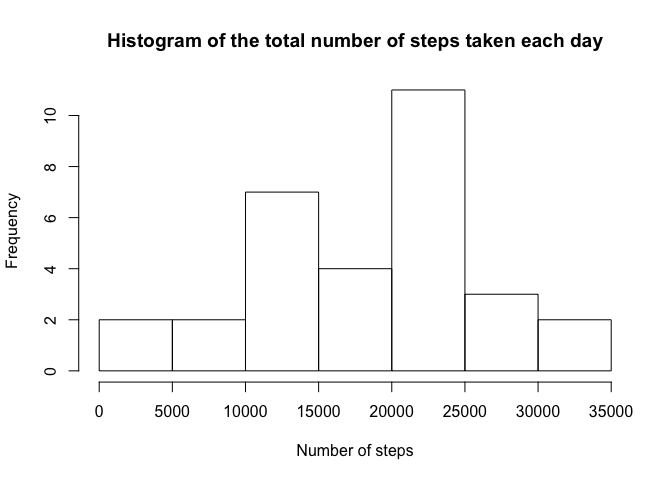
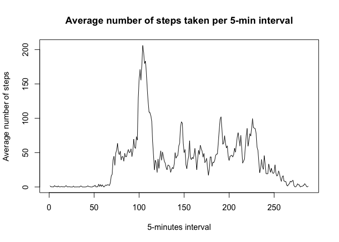
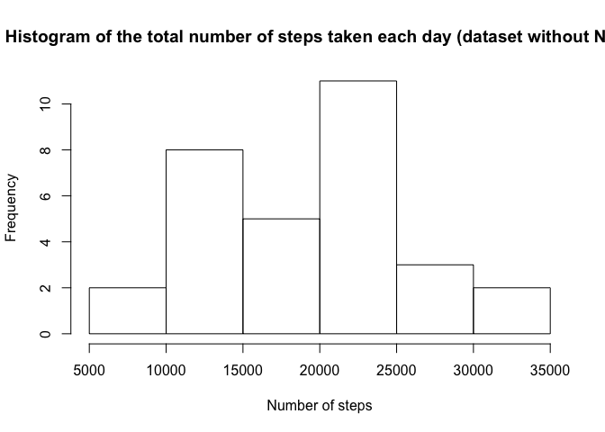
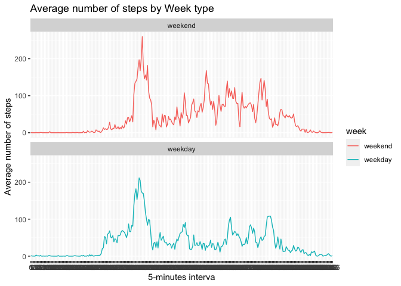

## Loading and preprocessing the data

### Loading data
Loading data

```r
library(dplyr)
```

```
## 
## Attaching package: 'dplyr'
```

```
## The following objects are masked from 'package:stats':
## 
##     filter, lag
```

```
## The following objects are masked from 'package:base':
## 
##     intersect, setdiff, setequal, union
```

```r
library(lubridate)
```

```
## 
## Attaching package: 'lubridate'
```

```
## The following object is masked from 'package:base':
## 
##     date
```

```r
library(ggplot2)
unzip("activity.zip")
df <- read.csv(file.path("activity.csv"),header = TRUE)
```

Checking data structure:

```r
str(df)
```

```
## 'data.frame':	17568 obs. of  3 variables:
##  $ steps   : int  NA NA NA NA NA NA NA NA NA NA ...
##  $ date    : Factor w/ 61 levels "2012-10-01","2012-10-02",..: 1 1 1 1 1 1 1 1 1 1 ...
##  $ interval: int  0 5 10 15 20 25 30 35 40 45 ...
```


### preprocessing data
Adapt class of the variables

```r
df$steps <- as.integer(df$steps)
df$date<-as.POSIXct(df$date)
df$interval <- as.factor(df$interval)
df <- as_tibble(df)
```


re-checking data structure

```r
print(df)
```

```
## # A tibble: 17,568 x 3
##    steps date                interval
##    <int> <dttm>              <fct>   
##  1    NA 2012-10-01 00:00:00 0       
##  2    NA 2012-10-01 00:00:00 5       
##  3    NA 2012-10-01 00:00:00 10      
##  4    NA 2012-10-01 00:00:00 15      
##  5    NA 2012-10-01 00:00:00 20      
##  6    NA 2012-10-01 00:00:00 25      
##  7    NA 2012-10-01 00:00:00 30      
##  8    NA 2012-10-01 00:00:00 35      
##  9    NA 2012-10-01 00:00:00 40      
## 10    NA 2012-10-01 00:00:00 45      
## # … with 17,558 more rows
```
**Preprocessing OK**


## What is mean total number of steps taken per day?

### Total number of steps taken per day

```r
steps_day <- df  %>% mutate(day=day(date))  %>% group_by(day) %>% summarize(Steps_per_day =sum(steps, na.rm = TRUE))
hist(steps_day$Steps_per_day,main = "Histogram of the total number of steps taken each day",xlab ="Number of steps")
```

<!-- -->


### Average number of steps taken per day

```r
steps_mean <- as.integer(mean(steps_day$Steps_per_day))
steps_mean_round <- as.integer(steps_mean)
steps_median <- as.integer(median(steps_day$Steps_per_day))
```

```r
print(steps_mean)
```

```
## [1] 18406
```

```r
print(steps_median)
```

```
## [1] 20525
```
The mean and median of the total number of steps taken per day are **18406** and **20525** respectively


## What is the average daily activity pattern?
### Calculate the average number fo steps per 5-min interval and plot the results

```r
steps_interval <- df  %>%  group_by(interval) %>% summarize(Steps_per_interval =mean(steps, na.rm = TRUE))
plot(steps_interval$Steps_per_interval,main = "Average number of steps taken per 5-min interval",xlab ="5-minutes interval",ylab = "Average number of steps",type = "l")
```

<!-- -->


### 5-min interval during which we observe on average the maximum number of steps

```r
Max_interval_num <- which(steps_interval$Steps_per_interval==max(steps_interval$Steps_per_interval))
Max_interval <- steps_interval$interval[steps_interval$Steps_per_interval==max(steps_interval$Steps_per_interval)]

Max_steps <- round(max(steps_interval$Steps_per_interval))
```

```r
print(Max_interval_num)
```

```
## [1] 104
```

```r
print(Max_interval) 
```

```
## [1] 835
## 288 Levels: 0 5 10 15 20 25 30 35 40 45 50 55 100 105 110 115 120 125 ... 2355
```

```r
print(Max_steps) 
```

```
## [1] 206
```
On average the maximum number of steps is performed on the interval n° **104**  (interval 835), which correspond to **206 steps.**


## Imputing missing values

### Calculating the number of missing values

```r
nb_NA <- sum(is.na(df$steps))
```
There are **2304** missing values in the dataset

### Filling missing values with the average number of steps for the corresponding intervals

```r
where_NA <- which(is.na(df$steps))
df_NA_filled <- df
for(f in 1:length(where_NA)){
  df_NA_filled$steps[f] <- steps_interval$Steps_per_interval[steps_interval$interval==df_NA_filled$interval[f]] 
}
```
### Calculate the average number fo steps per 5-min interval and plot the results (corrected dataset, with NAs replaced)

```r
steps_day_2 <- df_NA_filled  %>% mutate(day=day(date))  %>% group_by(day) %>% summarize(Steps_per_day =sum(steps, na.rm = TRUE))
hist(steps_day_2$Steps_per_day,main = "Histogram of the total number of steps taken each day (dataset without NAs)",xlab ="Number of steps")
```

<!-- -->
The histogramm of the total number of steps taken each day appears after replacing NAs values by the average number of steps for the corresponding period appears quite identical to the one including NAs values. Let's have a look to the median and mean....

### Total number of steps taken per day (on dataset with NA filled with average number of steps for corresponding intervals)

```r
steps_mean_2 <- mean(steps_day_2$Steps_per_day)
steps_mean_round_2 <- as.integer(steps_mean_2)
steps_median_2 <- as.integer(median(steps_day_2$Steps_per_day))
```


```r
print(steps_mean_2)
```

```
## [1] 19142.4
```

```r
print(steps_median_2)
```

```
## [1] 20525
```
**The mean and median of the total number of steps taken per day in the modified dataset are $19142$ and $20525$ respectively**

### Impact of replacing NAs values in the dataset on the mean and median of the total number of steps taken per day
|presence of NAs|Mean|Median|
|---|---|---|---|
|With missing values|18406|20525|
|Without missing values|19142|20525|
**We clearly see that the mediam is not impacted, whereas, we osberve a slight difference in the mean**

## Are there differences in activity patterns between weekdays and weekends?

Creating a new factor variable indicating whether a given date is a weekday or a weekend day

```r
steps_wday <- df_NA_filled  %>% mutate(wday=wday(date))
index_W<- steps_wday$wday!=6 & steps_wday$wday!=7
factor_W<- factor(index_W,levels=c(FALSE, TRUE), labels=c('weekend', 'weekday'))
steps_wday_grouped <- steps_wday %>% mutate(week= factor_W) %>% group_by(week,interval) %>% summarise(MEAN_STEPS=mean(steps, na.rm = TRUE))
```

Generating a plot to compare the average number of steps within a day during weekdays or weekend days

```r
ggplot(steps_wday_grouped , aes(x = interval , y = MEAN_STEPS, color=`week`)) + geom_line(group=1) + labs(title = "Average number of steps by Week type", x = "5-minutes interva", y = "Average number of steps") + facet_wrap(~`week` , ncol = 1, nrow=2)
```

<!-- -->
